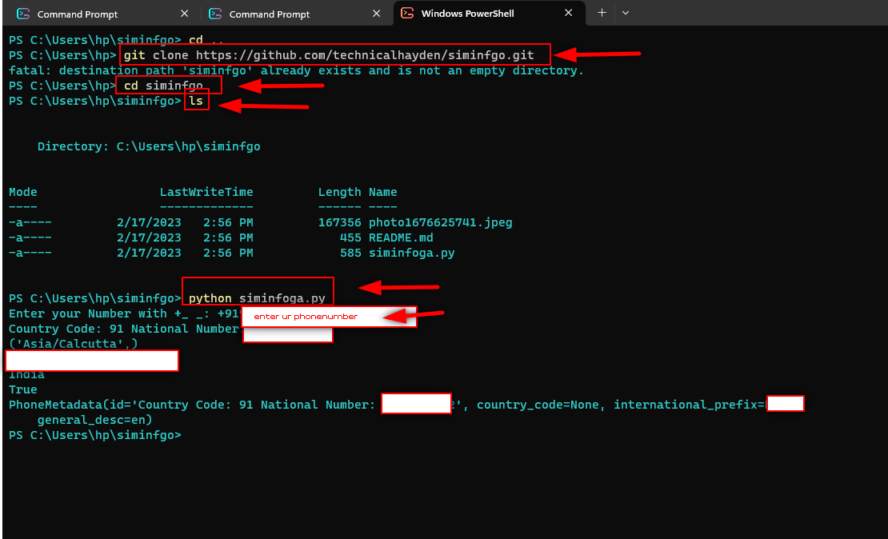

</a>

# Siminfgo
this is a python based file which get detailed information about number

## Requirements:

  
 
 
 ## Installation 
 
 1)open terminal pip install phonenumbers 
 2)git clone https://github.com/technicalhayden/siminfgo.git 
 3) cd siminfgo  
 4)ls 
 5)python siminfgo.py 
 6)then enter phone number in this format( +countrycode phonenumber  +19 08955567945)
 ##
 </a>
 
 
 ##
 <h3 align="left">Connect with me:</h3>

##
<h3 align="left">Support:</h3>
                            

  

 

